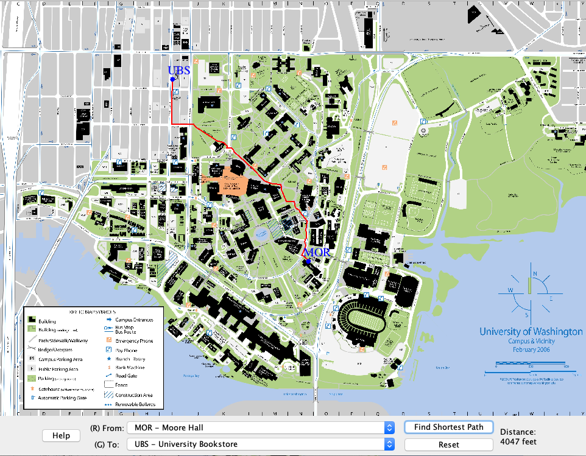

# CampusMap

### CampusMap, '소프트웨어 디자인 & 구현' 수업의 학기 단위 프로젝트입니다.

#### 구성 
 

1. Java 복습 - 간단한 클래스 작성.
2. 다항식 사칙연산 구현과 결과물 그래픽 출력.
3. 자료구조 그래프 (Graph) 구현 - 노드(Node)와 엣지(Edge)로 연결되어있는 객체간의 관계를 표현, Generic한 클래스로 구현.
4. Marvel Comics의 데이터를 사용해 Marvel캐릭터들의 관계도를 3번에서 구현된 그래프와 BFS탐색 알고리즘을 사용해 구현.
5. Weighted 엣지들과 Dijkstra 알고리즘을 구현해 두 캐릭터간의 최단거리를 공동으로 출연한 만화책 수에 반비례하여 표현.
6. 학교 내 건물들과 도보 데이터를 parsing 하고, MVC(Model-View-Controller) 패턴에 맞게 모델, 뷰, 컨트롤러를 구현함
7. 6번에 구현된 내용들을 Java GUI를 사용해 표현하는 프로그램을 사용자가 사용가능하도록 구현.

#### 결과물 사진
##### 초기화면

##### 건물 이름과 최단거리 출력

